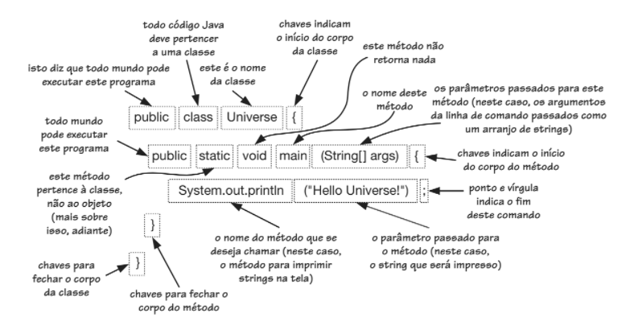
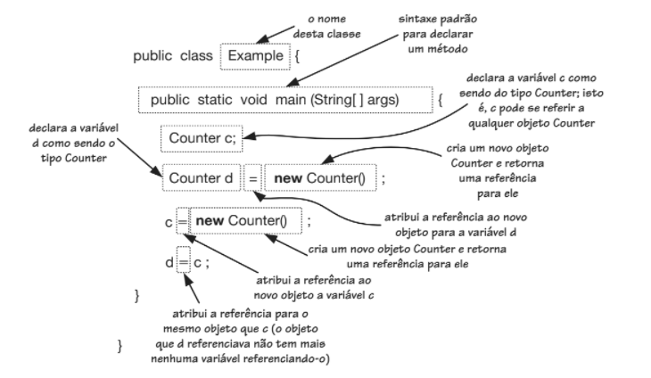

# Aula 02 - O que é um Objeto?

Assista aos vídeos: 

  1. [O que é um Objeto?](https://youtu.be/aR7CKNFECx0?t=48)
  1. [Criando Classes e Objetos em Java](https://youtu.be/wNaoX6VOj54?t=34)

> É **#fundamental** que você assista ao vídeo. É **#opcional** _(embora bem interessante)_ que você faça o exercício.

---

## Material Complementar

As imagens abaixo podem ser utilzadas como mapa mental sobre os elementos de um código Java.

### Programa Hello Universe

### Instanciando uma classe

---

## Exercício

### História

Mario é um personagem da franquia e série de jogos eletrônicos Super Mario da Nintendo, criado pelo desenvolvedor e designer de jogos eletrônicos japoneses Shigeru Miyamoto. Servindo como mascote da Nintendo e protagonista da série, Mario já apareceu em mais de 200 jogos desde sua criação.

### Aparência
Mario tem pele clara, é baixo um pouco corpulento. Ele tem olhos azuis brilhantes, nariz grande e um bigode grosso castanho-escuro. Mario tem cabelo castanho curto com duas costeletas, franjas grandes e um topete.

Ele veste uma camisa vermelha e um macacão azul com botões amarelos. Ele usa um boné vermelho com o símbolo "M" em seu nome e usa luvas brancas e sapatos marrons.

### Mais detalhes
Para mais detalhes, leia a fonte dessas informações [aqui](https://mario.fandom.com/wiki/Mario).

### Atividade

Crie uma classe Mario que represente uma abstração do personagem para um código Java. Nesta classe, você deve definir algumas características (atributos) físicas, um comportamento (método) que imprima suas características e um comportamento (método) que imprima alguns dos seus superpoderes.

Por fim, crie outra classe que contenha um método `main()`, instancie um objeto do tipo Mario e execute uma chamada para o método que imprima seus dados e outro que imprima alguns dos seus superpoderes. Execute o código e veja o resultado no _console_ (saída).

_**Após** fazer o exercício, dá uma conferida na [nossa solução](resolucao.md)._

---

👈 [Voltar para aula anterior](../aula01/aula.md) ..... [Avançar para próxima aula](../aula03/aula.md) 👉
