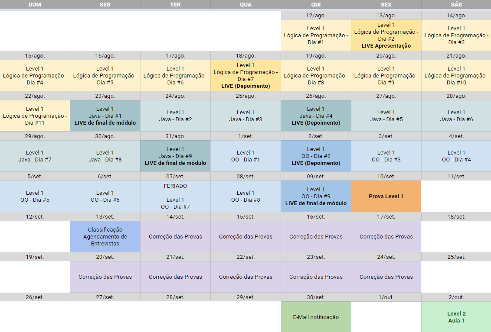

# CWI Reset - 4ª edição - Level 1

O objetivo dessa etapa é introduzi-lo aos conceitos de **fundamentos, lógica de programação e qualidade de software**. Todo profissional da área precisa conhecer a fundo estes assuntos e, para ajudá-lo neste processo, fizemos a curadoria de alguns bons materiais disponíveis gratuitamente na internet. 😁

Para passar desta etapa e chegar à fase do treinamento, você será submetido a um pequeno teste que mesclará perguntas de múltipla escolha e codificação.

Seu entendimento sobre este conteúdo é fundamental para que você esteja apto a participar do treinamento que faremos no Level 2. Portanto, dedique-se a estudar o material e pratique tudo o que for apresentado. 💪

...

## - Teste? Como assim? 😕

Nosso programa visa te capacitar para trabalhar em uma área com infinitas possibilidades.' 🚀 

Justamente por isso, recebemos **centenas** de inscrições. Nós gostaríamos de selecionar todo mundo para o programa, mas infelizmente é inviável fazer um bom treinamento de capacitação com tanta gente. 😔

Como acreditamos fortemente no potencial da nossa área, montamos esta etapa e elaboramos um teste para ser justo na escolha de quem está preparado para este super desafio. 💪

Nós separamos cuidadosamente todo conteúdo que você precisa conhecer, estudar e praticar. Agora é com você! 🚀

...

## - Mas e se tiver dúvidas, o que eu faço?? 😨

Relaxa! Estamos aqui para te ajudar 👊 #tamojunto

É importante você ter consciência de que deve buscar entender ao máximo o que houve no seu código antes de pedir ajuda. Isto é importante pois, na TI, apreciamos muito o autodidatismo. 😊

Caso ainda permaneça com alguma dúvida ou sinta que precisa de ajuda, poderá usar as **[Issues](https://github.com/cwi-reset/edicao-04-level-1/issues)** aqui do Github. Elas funcionam como um fórum: você cria uma nova issue e pode explicar a sua dúvida. Teremos um time de especialistas colaboradores da CWI para ajudá-lo.

Antes de abrir uma Issue:

👉 Procure por issues semelhantes à sua. Pode ser que alguém já tenha passado pela mesma situação que você;

👉 Evite usar uma issue existente para falar de um assunto desconexo. Não tem problema ter várias issues, o importante é mantermos a organização para que todas as dúvidas sejam respondidas.

👉 Se você viu alguma dúvida da qual sabe a resposta, não hesite em respondê-la e compartilhar seu conhecimento! Saiba que colaboração é uma das qualidades muito apreciadas por aqui 😉;

👉 Se você postou algo e acabou descobrindo a solução por conta própria, responda você mesmo explicando como resolveu o problema. Lembre-se: outra pessoa pode passar pelo mesmo problema;

👉 Use títulos fáceis de entender e de filtrar. Imagine, por exemplo, que você não conseguiu criar o algoritmo de verificação de maioridade da aula 05 no módulo de Lógica de Programação. Veja alguns exemplos de títulos ruins ❌ e bons ✅ pra gente conseguir te ajudar melhor:

... ❌ Erro

... ❌ Não sei o que fazer

... ❌ Problema na resolução do exercício

... ✅ Como resolver o algoritmo de maioridade da aula 05 do módulo de Lógica de Programação?

... ✅ [Aula 05] [Lógica de Programação] Erro na verificação de maioridade

👉 Coloque o máximo possível de detalhes na descrição da issue. Se puder, inclua alguns prints. Quanto mais informações, mais fácil para os outros conseguirem te ajudar.

👉 Mostre o seu código. Ao incluir o seu código entre 3 crases, o GitHub vai mostrar o código formatado. Veja o exemplo abaixo:

\```javascript

if (codigoFormatado) {

console.log("Este código aparecerá formatado no GitHub")

}

\```

Vai ser exibido assim:

```javascript
if (codigoFormatado) {
    console.log("Este código aparecerá formatado no GitHub")
}
```

**Atenção**: criamos uma issue de exemplo para te ajudar a entender como funciona e para que você "brinque" um pouco lá. Então agora sua `primeira missão` é [acessar a Issue](https://github.com/cwi-reset/edicao-04-level-1/issues/1) e adicionar um novo comentário nela se apresentando para a galera. Diga seu nome completo e de qual área você está vindo 😜

**Participe, pergunte, ajude e colabore.** Estas são características fundamentais e nós as valorizamos muito aqui na CWI 🤘

> Tentaremos responder todas as dúvidas o mais rápido possível, mas pode ser difícil atender a todos se houver muitas questões. Por isso mesmo, é essencial que você pesquise e corra atrás da solução também. Tenha em mente que o autodidatismo é super importante e muito valorizado na TI.

...

## - Beleza! E cadê o material de aprendizado?? 🤔

Calma aí, pequeno(a) Padawan!

👉 Todo conteúdo está disponível **[aqui](material.md)**. 👈

Todo material foi classificado entre **#fundamental**, que são coisas que você precisa entender e que _podem cair na avaliação_, e **#opcional**, que são coisas que você pode olhar se já conhecer o conteúdo básico, se já estiver adiantado ou mesmo se for um curioso 😜

Recomendamos fortemente que você acompanhe o material na sequência indicada e **_faça todos os exercícios_**.

...

## - Agora sim! Algo mais antes de eu começar? 😁

Eu sei que você já está louco(a) para sair programando, mas dá uma olhada nisso aqui:

Além de todo material e da disponibilidade de ajuda pelo GitHub, também planejamos algumas lives com o intuito de esclarecer melhor como o programa funcionará e também para te ajudar a tirar dúvidas! Massa, né?? 😄

Este é o cronograma inicial que planejamos:


> **Atenção**: este cronograma pode sofrer alterações! Portanto, fique ligado no seu e-mail pois informaremos por lá qualquer novidade.

## Calendário de Lives

| Data / Hora             | Objetivo                             | Link da Live                                                             |
| ----------------------- | ------------------------------------ | ------------------------------------------------------------------------ |
| 29/08 das 19h as 20:30h | Apresentação do Programa             | [Gravação - Live de Apresentação](https://vimeo.com/743407625/07db9090ff)|
| 05/09 das 19h as 20:30h | Final de módulo (1) + Depoimento     | https://vimeo.com/event/2389778/50624cbbc3                               |
| 09/09 das 19h as 20:30h | Final de módulo (2)                  | https://vimeo.com/event/2389779/400c63f29b                               |
| 16/09 das 19h as 20:30h | Final de módulo (3 e 4) + Depoimento | https://vimeo.com/event/2389786/8d2d76ec62                               |
| 19/09 das 19h as 20:30h | Final de módulo (5)                  | https://vimeo.com/event/2389791/f9b56be894                               |
| 22/09 das 19h as 20:30h | Final de módulo (6) + Depoimento     | https://vimeo.com/event/2389793/34baad3713                               |

...

✅ Agora, sim, você já tem toda informação de que precisa para começar a programar no **CWI Reset**. Bons estudos e boa sorte. 😊

👉 Todo material de estudo está disponível **[aqui](material.md)**. 👈

---

**Reset, restart, go!** 🚀
